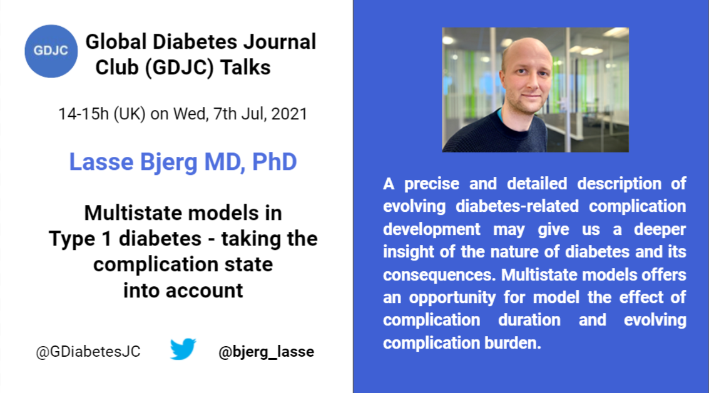

Welcome to the Global Diabetes Journal Club (GDJC) website! We aim to sustain a collegial, accessible platform for diabetes researchers, health care providers and the public to connect and learn about recent research across nutritional, clinical and genetic epidemiology as they apply to diabetes. Our members have joined GDJC meetings from 6 continents. 

We run two main programs:

  - **GDJC Talks** One hour long Zoom meetings that comprise an article/project presentation and discussion. 
  - **Ad hoc working groups** In Summer 2020, we created two research teams, each of which is preparing a systematic review on an aspect of prevention of type 2 diabetes. 
  
If you want stay updated, please join our mailing list [here](https://groups.google.com/g/global-diabetes-journal-club) where also announce upcoming talks and other relevant events.

Follow us on Twitter [@GDiabetesJC](https://twitter.com/gdiabetesjc)
And see previous talks on our [YouTube channel](https://www.youtube.com/channel/UCdBbu7haaggcoJqmhEx8cdg)

## Upcoming talks
### Lasse Bjerg - Multistate models in type 1 diabetes - taking the complication state into account

**The talk will be at 14-15h UK time on Wednesday July 7th, 2021**
All are welcome to join the event. Just register [here](link)

Lasse Bjerg is a medical doctor and researcher at the Steno Diabetes Center Aarhus. His research focus on type 1 diabetes and development of complications.

His talk will be about multistate models which can offers an opportunity to model the effect of complication duration and an evolving complication burden in people with type 1 diabetes.

## Latest GDJC Talk
### José Luis Flores-Guerrero – Branched chain amino acids and risk of type 2 diabetes

<iframe width="560" height="315" src="https://www.youtube.com/watch?v=A79LxR-D4RA" frameborder="0" allowfullscreen></iframe>

Global Diabetes Journal Club Talk by José Luis Flores-Guerrero, PhD student at the the University Medical Center Gröningen in the Netherlands, on circulating branched chain amino acids and risk of type 2 diabetes. 

He gives a detailed background of the topic, potential mechanisms that explain the relationship and discuss some of his own studies investigating branched chain amino acids and risk of type 2 diabetes based on the Dutch PREVEND cohort.

The talk is based on several of his papers on [type 2 diabetes](https://pubmed.ncbi.nlm.nih.gov/30518023/), [non-alcoholic fatty liver disease](https://pubmed.ncbi.nlm.nih.gov/30917546/) and [hypertension](https://pubmed.ncbi.nlm.nih.gov/31587574/).

During the discussion a [Mendelian randomization](https://pubmed.ncbi.nlm.nih.gov/27898682/) study was also mentioned. 

Follow José Luis on Twitter @JLuis_FG
