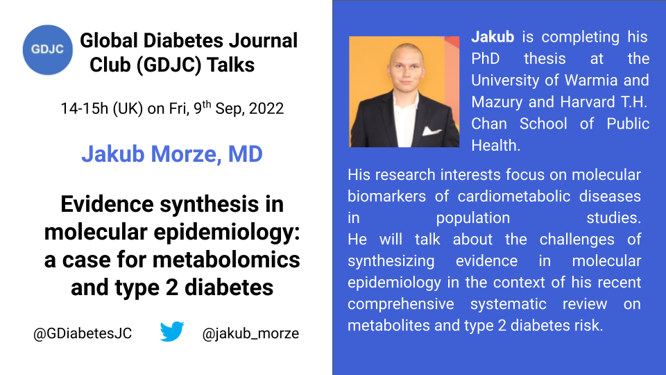

Welcome to the Global Diabetes Journal Club (GDJC) website! We aim to sustain a collegial, accessible platform for diabetes researchers, health care providers and the public to connect and learn about recent research across nutritional, clinical and genetic epidemiology as they apply to diabetes. We are committed to supporting early-career researchers interested in diabetes epidemiology. Our members have joined GDJC meetings from 6 continents. 

We run two main programs:

  - **GDJC Talks** Monthly hour-long Zoom meetings that include an article/project presentation and discussion. 
  - **Ad hoc working groups** In Summer 2020, we created two research teams, each of which is preparing a systematic review on an aspect of prevention of type 2 diabetes. 
  
If you want stay updated, please join our mailing list [here](https://groups.google.com/g/global-diabetes-journal-club), where we send announcements and reminders for our upcoming talks and other relevant events.

Follow us on Twitter @[GDiabetesJC](https://twitter.com/gdiabetesjc) and view our previous GDJC Talks on our [YouTube channel](https://www.youtube.com/channel/UCdBbu7haaggcoJqmhEx8cdg).

## Upcoming GDJC talk

### September 2022 - Jakub Morze, PhD student - Evidence synthesis in molecular epidemiology

Jakub Morze, PhD student at the University of Warmia and Mazury and Harvard T.H. Chan School of Public Health Will give a talk about the complexity of synthesizing evidence in molecular epidemiology using his recent systematic review of metabolites and type 2 diabetes risk as an example. Link to the paper is [here](https://diabetesjournals.org/care/article/45/4/1013/144892/Metabolomics-and-Type-2-Diabetes-Risk-An-Updated)


The talk will be on September 9th, at 2-3pm UK time.

Register [here](https://aarhusuniversity.zoom.us/meeting/register/u5wpf-6qqDMsEtEtFDTFQ99EVeYe9lPIIGSQ)



## Latest GDJC Talk

### August 2022 - Daniela Nickel, PhD student - Healthy food diversity and risk of chronic diseases

Daniela Nickel, MSc, is a PhD student at the German Institute of Human Nutrition Potsdam-Rehbruecke and investigates psychological and social determinants of healthy food diversity. 

Healthy food diversity is a metric trying to capture both diet quality, here determined by the German Dietary Guidelines, and the diversity of the diet, eating different types of food. 

The results presented in this presentation are preliminary results and may change according to further analyses. 

After the recording the presentation we discussed the possibility of separating the diet quality and the diversity aspects to understand how each concept relate to development of chronic diseases. 

```{r august-2022, echo=FALSE}

library("vembedr")

embed_url("https://youtu.be/vWyiELp_um4")

```

