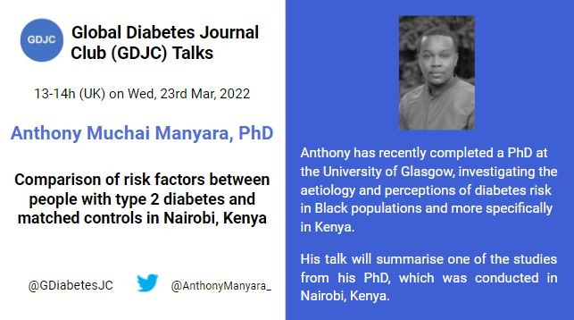

Welcome to the Global Diabetes Journal Club (GDJC) website! We aim to sustain a collegial, accessible platform for diabetes researchers, health care providers and the public to connect and learn about recent research across nutritional, clinical and genetic epidemiology as they apply to diabetes. Our members have joined GDJC meetings from 6 continents. 

We run two main programs:

  - **GDJC Talks** Monthly hour-long Zoom meetings that include an article/project presentation and discussion. 
  - **Ad hoc working groups** In Summer 2020, we created two research teams, each of which is preparing a systematic review on an aspect of prevention of type 2 diabetes. 
  
If you want stay updated, please join our mailing list [here](https://groups.google.com/g/global-diabetes-journal-club) where also announce upcoming talks and other relevant events.

Follow us on Twitter @[GDiabetesJC](https://twitter.com/gdiabetesjc)
And see previous talks on our [YouTube channel](https://www.youtube.com/channel/UCdBbu7haaggcoJqmhEx8cdg)

## Upcoming talks

### Anthony Muchai Manyara

We are delighted to invite Anthony Muchai Manyara, who recently defended his PhD thesis at the University of Glasgow, to give our March 2022 GDJC Talk. Dr. Manyara will discuss his research on comparing risk factors between people with type 2 diabetes and matched controls in Nairobi, Kenya. 

This talk will take place on Wed, 23rd March, 2022 at 13-14h UK time: [please register here to get the calendar reminder and Zoom link.](https://nih.zoomgov.com/meeting/register/vJItcuuvrTgqGQlL1qB-k_s1tjM2AvDR2I4). Details and bio for Dr. Manyara are pictured below.



## Latest GDJC Talk

### Research Associate, Alisa Kjaergaard - Mendelian randomization: causal inference without intervention?

```{r february-2022, echo=FALSE}

library("vembedr")

embed_url("https://youtu.be/_lZdkg_yNqw")

```

Global Diabetes Journal Club Talk by Research Associate Alisa Kjaergaard from the Steno Diabetes Center Aarhus, Aarhus, Denmark, on Mendelian randomization with examples related to diabetes research. Dr. Kjaergaard gave an introduction to the key concepts of Mendelian Randomization. Indeed, this talk is very relevant to those new to the topic of Mendelian Randomization.

Her most recent published studies include Mendelian Randomization and regular observational studies investigating the link between [obesity and kidney funtion](https://academic.oup.com/clinchem/advance-article-abstract/doi/10.1093/clinchem/hvab249/6469631?redirectedFrom=fulltext&login=false), [thyroid function and sex hormones](https://link.springer.com/article/10.1007%2Fs10654-021-00721-z) and [homocysteine and female fertility](https://www.nature.com/articles/s41430-021-00898-2).

During the Q&A, which was not recorded, we also the use of causal language, the issue with pleiotropy in two-sample Mendelian randomization and issues with using machine learning methods to identify a large number of genetic polymorphisms associated with an exposure of interest.  

For more information about Dr. Kjaergaard follow this [link](https://www.stenoaarhus.dk/kontakt/Alisa-Kjaergaard/)
