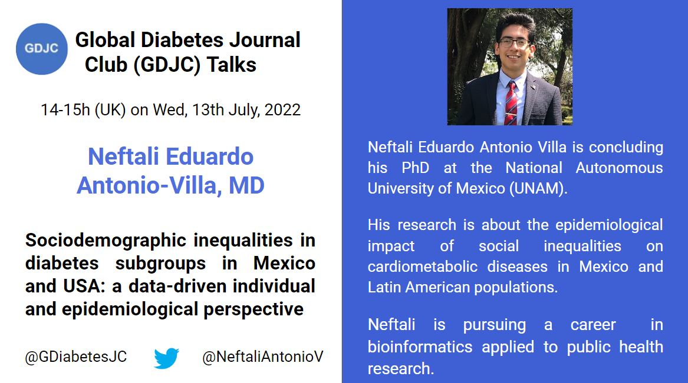

Welcome to the Global Diabetes Journal Club (GDJC) website! We aim to sustain a collegial, accessible platform for diabetes researchers, health care providers and the public to connect and learn about recent research across nutritional, clinical and genetic epidemiology as they apply to diabetes. We are especially committed to supporting early-career researchers interested in diabetes epidemiology. Our members have joined GDJC meetings from 6 continents. 

We run two main programs:

  - **GDJC Talks** Monthly hour-long Zoom meetings that include an article/project presentation and discussion. 
  - **Ad hoc working groups** In Summer 2020, we created two research teams, each of which is preparing a systematic review on an aspect of prevention of type 2 diabetes. 
  
If you want stay updated, please join our mailing list [here](https://groups.google.com/g/global-diabetes-journal-club), where we send announcements and reminders for our upcoming talks and other relevant events.

Follow us on Twitter @[GDiabetesJC](https://twitter.com/gdiabetesjc) and view our previous GDJC Talks on our [YouTube channel](https://www.youtube.com/channel/UCdBbu7haaggcoJqmhEx8cdg).

## Upcoming GDJC talk

### July 2022 - Neftali Eduardo Antonio-Villa, MD - Sociodemographic inequalities in diabetes subgroups in Mexico and USA: a data-driven individual and epidemiological perspective

We are delighted to welcome [Dr. Neftali Eduardo Antonio-Villa](https://loop.frontiersin.org/people/1092901/overview) (UNAM), who is concluding his PhD training at the National Autonomous University of Mexico. Formally trained in clinical medicine, he is interested in the impact of social inequalities on cardiometabolic disease outcomes in Mexico, and more broadly, Latin American populations. Dr. Antonio-Villa will speak about sociodemographic inequalities in people with diabetes in Mexico and the US.

This talk will take place on Wed, 13th July, from 14.00-15.00 (UK time; details pictured below). Please [register here](https://nih.zoomgov.com/meeting/register/vJItcuysqjgjHL9XjO5YXuoXI8hktgU4KjY).



## Latest GDJC Talk

### June 2022 - Dr. Lauren Wedekind - Investigating the relationship between birth weight and type 2 diabetes
Our June GDJC Talk, marking 3 years since our first one, was given by Lauren Wedekind, one of our GDJC organizers. 

Lauren shared work from her PhD research on diabetes and birth weight and summarized some previous work that inspired it. This talk was specifically designed to be accessible to all: she used terms that those without formal training in diabetes or epidemiology can better understand. 

```{r june-2022, echo=FALSE}

library("vembedr")

embed_url("https://youtu.be/XTW3ZAz2EuA")

```
