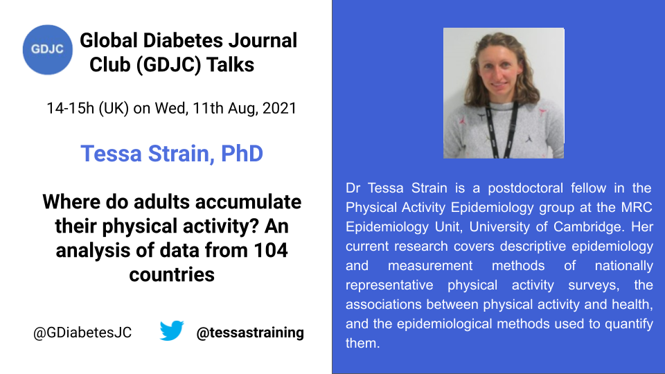

Welcome to the Global Diabetes Journal Club (GDJC) website! We aim to sustain a collegial, accessible platform for diabetes researchers, health care providers and the public to connect and learn about recent research across nutritional, clinical and genetic epidemiology as they apply to diabetes. Our members have joined GDJC meetings from 6 continents. 

We run two main programs:

  - **GDJC Talks** Monthly hour-long Zoom meetings that include an article/project presentation and discussion. 
  - **Ad hoc working groups** In Summer 2020, we created two research teams, each of which is preparing a systematic review on an aspect of prevention of type 2 diabetes. 
  
If you want stay updated, please join our mailing list [here](https://groups.google.com/g/global-diabetes-journal-club) where also announce upcoming talks and other relevant events.

Follow us on Twitter [@GDiabetesJC](https://twitter.com/gdiabetesjc)
And see previous talks on our [YouTube channel](https://www.youtube.com/channel/UCdBbu7haaggcoJqmhEx8cdg)

## Upcoming talks
### Tessa Strain - Where do adults accumulate their physical activity? An analysis of data from 104 countries

**The talk will be at 14-15h UK time on Wednesday August 11th, 2021**
All are welcome to join the event. Just register [here](https://nih.zoomgov.com/meeting/register/vJItdumurjIjHg4BOxl8QsB0kSo9-qyFHUI)

Dr Strain is a postdoctoral fellow in the Physical Activity Epidemiology group at the MRC Epidemiology Unit, University of Cambridge. 

Her current research covers descriptive epidemiology and measurement methods of nationally representative physical activity surveys, the associations between physical activity and health, and the epidemiological methods used to quantify them.

The talk is based on [this](https://bjsm.bmj.com/content/54/24/1488) study about levels of domain-specific physical activity at work, in the household, for travels and for leisure among 327,789 adult from 104 countries.

Get ready to learn more about physical activity epidemiology.

## Latest GDJC Talk
### Dr. Lasse Bjerg - Multistate models in type 1 diabetes - taking the complication state into account

Global Diabetes Journal Club Talk by Lasse Bjerg, Postdoc at the Steno Diabetes Center Aarhus in Denmark, on multistate models on type 1 diabetes.

Unfortunately, we were not able to record this session, but here is a recap of the main points.

Multistate models are a powerful tool to understand disease transitions. However, there are some drawbacks:

1. The model gets very complicated the more states that are included, 3-4 seems to be a max.
2. The model also regard transitions as instantaneous, although this is not always be the case. Example: ok for myocardial infarction, not so for diabetic kidney disease or retinopathy.
3. Requires a lot of longitudinal data, typically in the form of a register.

The talk was based on [this paper](https://academic.oup.com/ije/advance-article-abstract/doi/10.1093/ije/dyaa290/6102236?redirectedFrom=fulltext) about duration of diabetes-related complications and mortality in type 1 diabetes using Swedish register data.

Follow Lasse @[bjerg_lasse](https://twitter.com/bjerg_lasse)