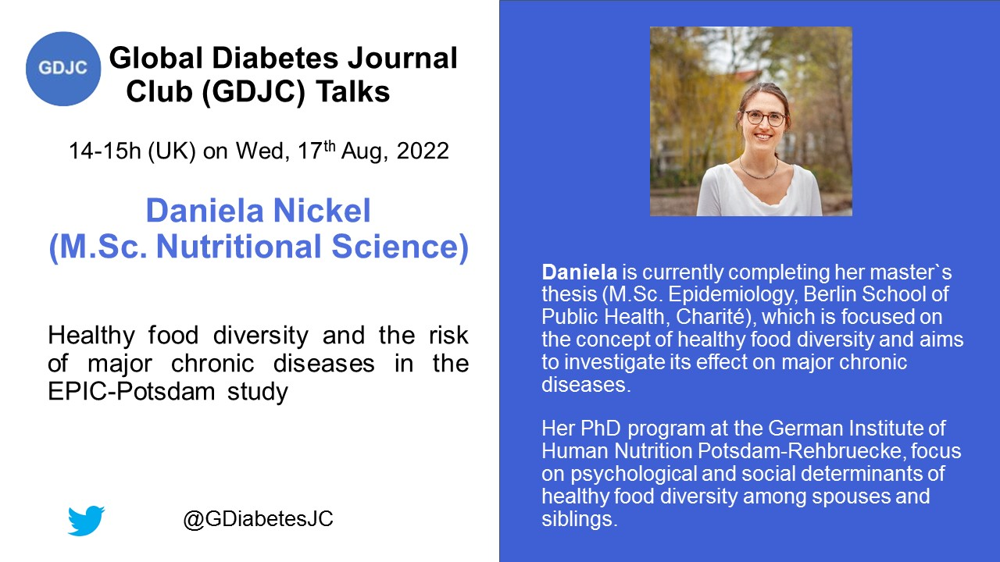

Welcome to the Global Diabetes Journal Club (GDJC) website! We aim to sustain a collegial, accessible platform for diabetes researchers, health care providers and the public to connect and learn about recent research across nutritional, clinical and genetic epidemiology as they apply to diabetes. We are committed to supporting early-career researchers interested in diabetes epidemiology. Our members have joined GDJC meetings from 6 continents. 

We run two main programs:

  - **GDJC Talks** Monthly hour-long Zoom meetings that include an article/project presentation and discussion. 
  - **Ad hoc working groups** In Summer 2020, we created two research teams, each of which is preparing a systematic review on an aspect of prevention of type 2 diabetes. 
  
If you want stay updated, please join our mailing list [here](https://groups.google.com/g/global-diabetes-journal-club), where we send announcements and reminders for our upcoming talks and other relevant events.

Follow us on Twitter @[GDiabetesJC](https://twitter.com/gdiabetesjc) and view our previous GDJC Talks on our [YouTube channel](https://www.youtube.com/channel/UCdBbu7haaggcoJqmhEx8cdg).

## Upcoming GDJC talk

### August 2022 - Daniela Nickel, PhD student - Healthy food diversity and risk of chronic diseases

Daniela Nickel is a PhD student at the German Institute of Human Nutrition Potsdam-Rehbruecke and investigates psychological and social determinants of healthy food diversity. A concept that she will explain duinrg her presentation on the relationship between healthy food diversity and risk of major chronic diseases.

Register [here](https://aarhusuniversity.zoom.us/meeting/register/u5UrfuCgrj0qE90wlTfzd4YlJQs0oVbKMEk6 ) to join the talk.



## Latest GDJC Talk

### July 2022 - Neftali Eduardo Antonio-Villa, MD - Sociodemographic inequalities in diabetes subgroups in Mexico and USA: a data-driven individual and epidemiological perspective

```{r juli-2022, echo=FALSE}

library("vembedr")

embed_url("https://youtu.be/UgZSmB5CvIc")

```

[Dr. Neftali Eduardo Antonio-Villa](https://loop.frontiersin.org/people/1092901/overview), who is concluding his PhD training at the National Autonomous University of Mexico (UNAM), is formally trained in clinical medicine and is interested in the impact of social inequalities on cardiometabolic disease outcomes in Mexico, and more broadly, Latin American populations.

His talk centered around two of his recent research projects, one about [sociodemographic inequalities in type 1 diabetes in Mexico](https://pubmed.ncbi.nlm.nih.gov/34487758/) and the other on [diabetes subgroups](https://pubmed.ncbi.nlm.nih.gov/34687306/) and whether the prevalence of these are the same in USA and in Mexico. For the subgroups, he also presented results from an ongoing study.
