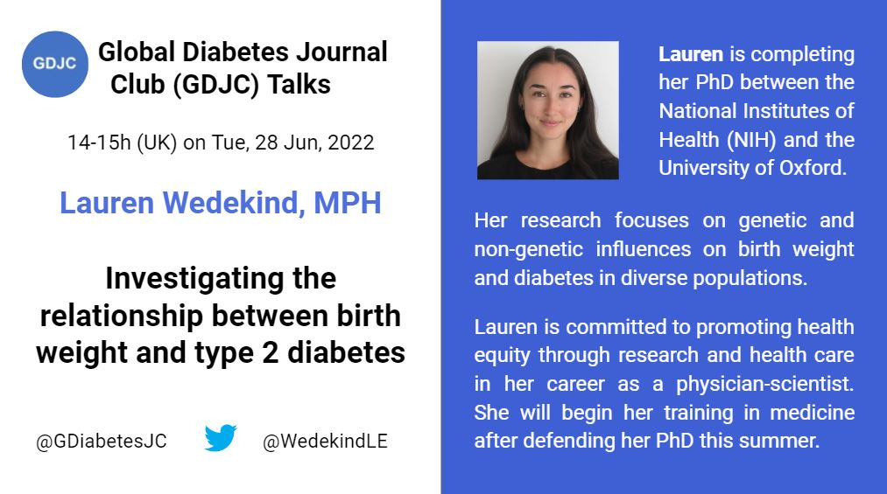

Welcome to the Global Diabetes Journal Club (GDJC) website! We aim to sustain a collegial, accessible platform for diabetes researchers, health care providers and the public to connect and learn about recent research across nutritional, clinical and genetic epidemiology as they apply to diabetes. Our members have joined GDJC meetings from 6 continents. 

We run two main programs:

  - **GDJC Talks** Monthly hour-long Zoom meetings that include an article/project presentation and discussion. 
  - **Ad hoc working groups** In Summer 2020, we created two research teams, each of which is preparing a systematic review on an aspect of prevention of type 2 diabetes. 
  
If you want stay updated, please join our mailing list [here](https://groups.google.com/g/global-diabetes-journal-club) where also announce upcoming talks and other relevant events.

Follow us on Twitter @[GDiabetesJC](https://twitter.com/gdiabetesjc)
And see previous talks on our [YouTube channel](https://www.youtube.com/channel/UCdBbu7haaggcoJqmhEx8cdg)

## Upcoming talks

### Lauren Wedekind - Investigating the relationship between birth weight and type 2 diabetes
Our June GDJC Talk, marking 3 years since our first one, will be from Lauren Wedekind, one of our GDJC organizers. Lauren will share about her PhD research on diabetes and birth weight and summarize some previous work that inspired it. This talk is specifically designed to be accessible to all: she will be using terms that those without formal training in diabetes or epidemiology will be able to understand.

This talk will take place on Tue, 28th June, from 14.00-15.00 (UK time; details pictured below). Please [register here](https://nih.zoomgov.com/meeting/register/vJIsce-rrj0pEwbiIipwoc7N60xVzfcUqD8).



## Latest GDJC Talk

### Dr. Gabriela Carrillo Balam - Sex differences in diabetes and depression

```{r may-2022, echo=FALSE}

library("vembedr")

embed_url("https://youtu.be/4plc-A0eMaA")

```

Dr. Carrillo gave a talk about her ongoing study showing some interesting differences in the prevalence of diabetes and depression in Mexican men and women. Note, the study is not yet published, meaning that the results have yet to be peer reviewed. We will give an update, when the study has been published. 

The study was based on data from the Mexican National Health and Nutrition Survey 2018-2019 and the study protocol was pre-registered [here](https://osf.io/g3bsk)

In the talk she describes the overlapping etiology of diabetes and depression within biological, environmental, social and behavioral aspects. 

The key findings in the study was that women had a higher prevalence of diabetes than men and women also had a higher prevalence of depression than men. In particular, their interaction analysis suggested that there was an additive interaction. Meaning that women with diabetes was more likely to have depression above what is expected based on having diabetes or being a women alone. 
