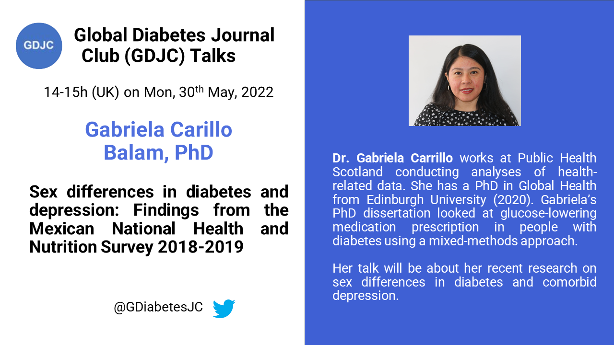

Welcome to the Global Diabetes Journal Club (GDJC) website! We aim to sustain a collegial, accessible platform for diabetes researchers, health care providers and the public to connect and learn about recent research across nutritional, clinical and genetic epidemiology as they apply to diabetes. Our members have joined GDJC meetings from 6 continents. 

We run two main programs:

  - **GDJC Talks** Monthly hour-long Zoom meetings that include an article/project presentation and discussion. 
  - **Ad hoc working groups** In Summer 2020, we created two research teams, each of which is preparing a systematic review on an aspect of prevention of type 2 diabetes. 
  
If you want stay updated, please join our mailing list [here](https://groups.google.com/g/global-diabetes-journal-club) where also announce upcoming talks and other relevant events.

Follow us on Twitter @[GDiabetesJC](https://twitter.com/gdiabetesjc)
And see previous talks on our [YouTube channel](https://www.youtube.com/channel/UCdBbu7haaggcoJqmhEx8cdg)

## Upcoming talks

### Dr. Gabriela Carrillo Balam - Sex differences in diabetes and depression
Dr. Gabriela Carrillo Balam will give our May GDJC Talk on the topic of sex differences in diabetes and depression. She will present findings from the Mexican National Health and Nutrition Survey 2018-2019.

Sign up for the talk [here](https://nih.zoomgov.com/meeting/register/vJIsdOygrj0uHe2p4Acu4thMPpcnjlPDr30)



For more upcoming talks go [here](https://gdjc.github.io/website/calendar.html)

## Latest GDJC Talk

### Dr. Cassie Mitchell and Statistician Emma Stinson - Metabolic responses to a mixed meal tolerance test in individuals at risk of type 2 diabetes

```{r april-2022, echo=FALSE}

library("vembedr")

embed_url("https://youtu.be/6Zp7l9Ayv94")

```

[Dr. Cassie Mitchell, PhD, RD (postdoctoral fellow)](https://www.researchgate.net/profile/Cassie-Mitchell) and [Emma Stinson, MPH (statistician)](https://www.researchgate.net/profile/Emma-Stinson) at [NIH/NIDDK Phoenix Epidemiology and Clinical Research Branch](https://www.niddk.nih.gov/research-funding/at-niddk/labs-branches/phoenix-epidemiology-clinical-research-branch) jointly presented their work on metabolic responses to a mixed meal tolerance test in individuals at risk of type 2 diabetes. 

In their study, they compared the association between different metrics, such as the area under the curve, from the oral glucose tolerance test or a mixed meal tolerance test and risk of type 2 diabetes. 

In the Q&A there were several interesting questions. Firstly, it is worth noting that the population in this study were relatively young (mean age about 26 years) and were all mostly indigenous populations which are known to have a higher genetic predisposition to develop type 2 diabetes. This may make it hard to compare the results to other populations. Overall, the oral glucose tolerance test provided greater absolute glucose values due to a higher dose compared to the mixed meal. The mixed meal may not stress the system in a similar way and hence may not be able to detect early stages of risk. 

On the other hand, a mixed meal challenge may be easier to handle for the participants. The mixed meal used here consisted of 40 energy from carbohydrates, 40% from fat and 20% from protein. The total energy contribution was 33% of total daily energy need. One issue with the mixed meal is, however, that it is hard to standardize across studies because there is no consensus on the composition or which foods to use. 

One of the advantages of using a mixed meal challenge is that is may reveal other metabolic dysfunctions than only glucose which the oral glucose tolerance test is designed for. However, more research from this project will cast light on this question. 

Lastly, future investigations of this dataset will look at various other measures of the glucose curves to examine other differences between the mixed meal challenge and oral glucose tolerance test.


