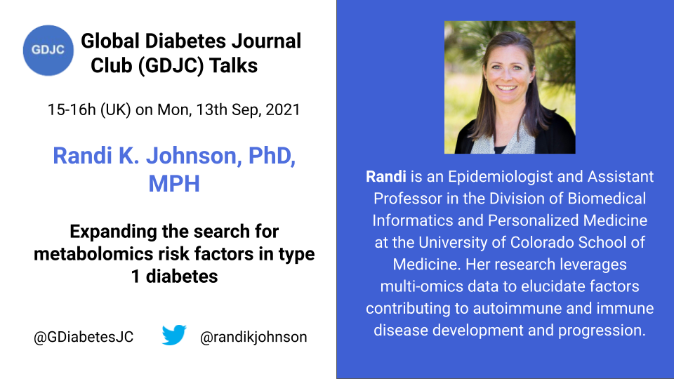
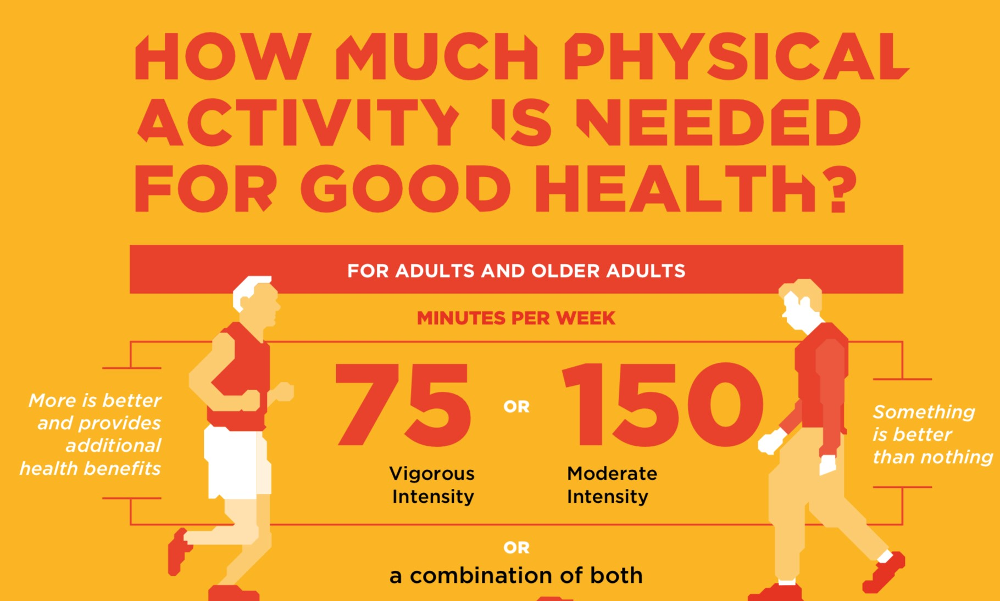

Welcome to the Global Diabetes Journal Club (GDJC) website! We aim to sustain a collegial, accessible platform for diabetes researchers, health care providers and the public to connect and learn about recent research across nutritional, clinical and genetic epidemiology as they apply to diabetes. Our members have joined GDJC meetings from 6 continents. 

We run two main programs:

  - **GDJC Talks** Monthly hour-long Zoom meetings that include an article/project presentation and discussion. 
  - **Ad hoc working groups** In Summer 2020, we created two research teams, each of which is preparing a systematic review on an aspect of prevention of type 2 diabetes. 
  
If you want stay updated, please join our mailing list [here](https://groups.google.com/g/global-diabetes-journal-club) where also announce upcoming talks and other relevant events.

Follow us on Twitter @[GDiabetesJC](https://twitter.com/gdiabetesjc)
And see previous talks on our [YouTube channel](https://www.youtube.com/channel/UCdBbu7haaggcoJqmhEx8cdg)

## Upcoming talks
### Randi K. Johnson - Expanding the search for metabolomocs risk factors in type 1 diabetes

We are pleased to announce the details of the next GDJC Talk. This time we have Assistant Professor Randi K Johnson from the University of Colorado School of Medicine to talk about the use of metabolomics in identifying new risk factors in type 1 diabetes.

The talk will be on Monday, 13th September, 15-16h UK time.

[Click here](https://nih.zoomgov.com/meeting/register/vJItc-yrrzsuE7GKR15wOjop7Lmt_OKoNbw) to register for the talk. 




## Latest GDJC Talk
### Tessa Strain - Where do adults accumulate their physical activity? An analysis of data from 104 countries

```{r august-2021, , echo=FALSE}

library("vembedr")

embed_url("https://youtu.be/Dyri_pJJQZw")

```

Global Diabetes Journal Club Talk by Dr. Tessa Strain, a postdoctoral fellow in the Physical Activity Epidemiology group at the MRC Epidemiology Unit, University of Cambridge, on where adults accumulate their physical activity. 

She provided an overview of current physical activity guidelines that focus on moderate to vigorous physical activity and thereafter discuss a study she lead on characterizing where adults from 104 different countries get the physical activity from.

The figure below show the most recent physical activity guidelines from [WHO](https://www.who.int/activities/ensuring-sports-for-all)



The talk was based [this](https://bjsm.bmj.com/content/54/24/1488) paper published in the British Journal of Sports Medicine 

During the discussion we also talk about the physical activity paradox, where greater levels of occupational physical activity should be linked to higher risk of mortality. However, this may be due to poor adjustment of relevant confounders, which [this](https://www.thelancet.com/journals/lanpub/article/PIIS2468-2667(21)00032-3/fulltext) paper suggests.

Follow Dr. Tessa Strain on Twitter @tessastraining