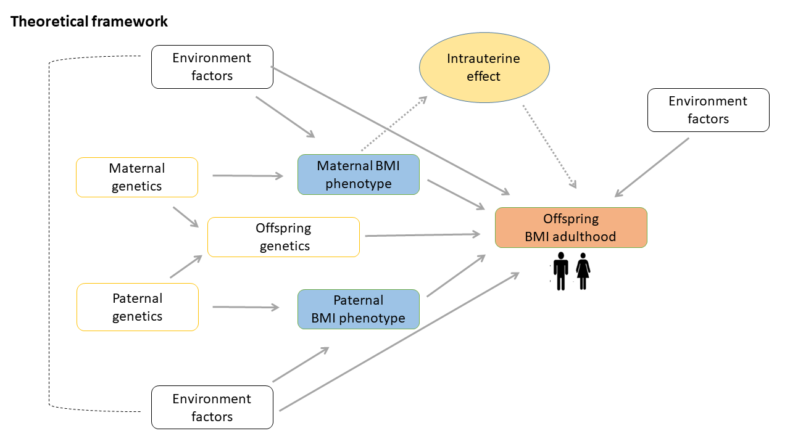
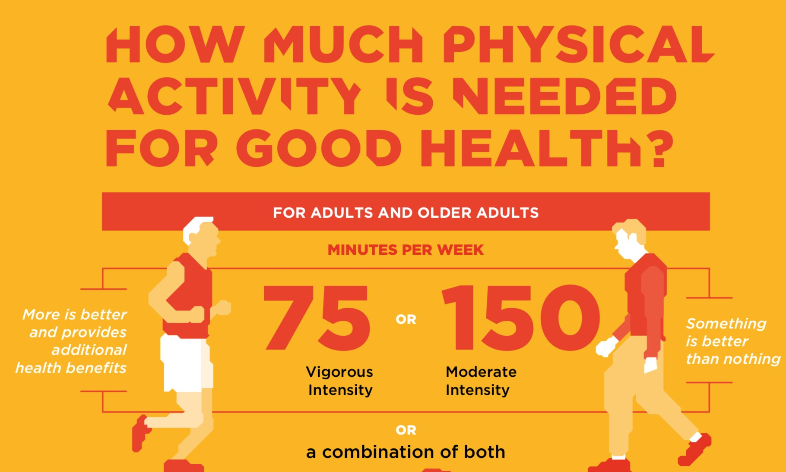
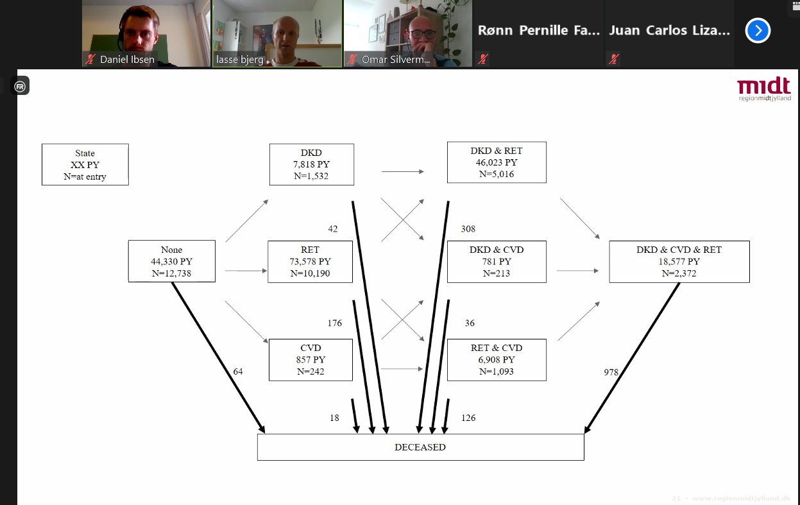

# June 2022

### Dr. Lauren Wedekind - Investigating the relationship between birth weight and type 2 diabetes
Our June GDJC Talk, marking 3 years since our first one, was given by Lauren Wedekind, one of our GDJC organizers. 

Lauren shared work from her PhD research on diabetes and birth weight and summarized some previous work that inspired it. This talk was specifically designed to be accessible to all: she used terms that those without formal training in diabetes or epidemiology can better understand. 

**Video coming soon**

# May 2022

### Dr. Gabriela Carrillo Balam - Sex differences in diabetes and depression

```{r may-2022, echo=FALSE}

library("vembedr")

embed_url("https://youtu.be/4plc-A0eMaA")

```

Dr. Carrillo gave a talk about her ongoing study showing some interesting differences in the prevalence of diabetes and depression in Mexican men and women. Note, the study is not yet published, meaning that the results have yet to be peer reviewed. We will give an update, when the study has been published. 

The study was based on data from the Mexican National Health and Nutrition Survey 2018-2019 and the study protocol was pre-registered [here](https://osf.io/g3bsk)

In the talk she describes the overlapping etiology of diabetes and depression within biological, environmental, social and behavioral aspects. 

The key findings in the study was that women had a higher prevalence of diabetes than men and women also had a higher prevalence of depression than men. In particular, their interaction analysis suggested that there was an additive interaction. Meaning that women with diabetes was more likely to have depression above what is expected based on having diabetes or being a women alone. 

# April 2022

### Dr. Cassie Mitchell and Statistician Emma Stinson - Metabolic responses to a mixed meal tolerance test in individuals at risk of type 2 diabetes

```{r april-2022, echo=FALSE}

library("vembedr")

embed_url("https://youtu.be/6Zp7l9Ayv94")

```

[Dr. Cassie Mitchell, PhD, RD (postdoctoral fellow)](https://www.researchgate.net/profile/Cassie-Mitchell) and [Emma Stinson, MPH (statistician)](https://www.researchgate.net/profile/Emma-Stinson) at [NIH/NIDDK Phoenix Epidemiology and Clinical Research Branch](https://www.niddk.nih.gov/research-funding/at-niddk/labs-branches/phoenix-epidemiology-clinical-research-branch) jointly presented their work on metabolic responses to a mixed meal tolerance test in individuals at risk of type 2 diabetes. 

In their study, they compared the association between different metrics, such as the area under the curve, from the oral glucose tolerance test or a mixed meal tolerance test and risk of type 2 diabetes. 

In the Q&A there were several interesting questions. Firstly, it is worth noting that the population in this study were relatively young (mean age about 26 years) and were all mostly indigenous populations which are known to have a higher genetic predisposition to develop type 2 diabetes. This may make it hard to compare the results to other populations. Overall, the oral glucose tolerance test provided greater absolute glucose values due to a higher dose compared to the mixed meal. The mixed meal may not stress the system in a similar way and hence may not be able to detect early stages of risk. 

On the other hand, a mixed meal challenge may be easier to handle for the participants. The mixed meal used here consisted of 40 energy from carbohydrates, 40% from fat and 20% from protein. The total energy contribution was 33% of total daily energy need. One issue with the mixed meal is, however, that it is hard to standardize across studies because there is no consensus on the composition or which foods to use. 

One of the advantages of using a mixed meal challenge is that is may reveal other metabolic dysfunctions than only glucose which the oral glucose tolerance test is designed for. However, more research from this project will cast light on this question. 

Lastly, future investigations of this dataset will look at various other measures of the glucose curves to examine other differences between the mixed meal challenge and oral glucose tolerance test.

# March 2022

### Anthony Muchai Manyara - Comparison of risk factors between people with and without type 2 diabetes in Nairobi

```{r march-2022, echo=FALSE}

library("vembedr")

embed_url("https://youtu.be/s1j_b-yfUBM")

```

Dr. Anthony Muchai Manyara from the University of Glasgow, gave our March 2022 GDJC Talk on the topic of risk factors in people with and without type 2 diabetes in Nairobi, Africa. The talk was based on [this paper](https://onlinelibrary.wiley.com/doi/10.1111/tmi.13629). 

The discussion after the talk focused on how the controls were sampled and potential issues with this. Although the methods for doing this in the study was not ideal (asking participants to bring a frend of similar age and sex), there was also a practical consideration that this was deemed the best way of recruiting controls under the circumstances. 

The study also revealed some interesting findings regarding differences in grip strengths and central adiposity between those with and without type 2 diabetes.

All in all, the study points to some risk factors like grip strength and central adiposity as being important to monitor in this setting prospective studies are needed to investigate these further.

# February 2022

### Research Associate, Alisa Kjaergaard - Mendelian randomization: causal inference without intervention?

```{r february-2022, echo=FALSE}

library("vembedr")

embed_url("https://youtu.be/_lZdkg_yNqw")

```

Global Diabetes Journal Club Talk by Research Associate Alisa Kjaergaard from the Steno Diabetes Center Aarhus, Aarhus, Denmark, on Mendelian randomization with examples related to diabetes research. Dr. Kjaergaard gave an introduction to the key concepts of Mendelian Randomization. Indeed, this talk is very relevant to those new to the topic of Mendelian Randomization.

Her most recent published studies include Mendelian Randomization and regular observational studies investigating the link between [obesity and kidney funtion](https://academic.oup.com/clinchem/advance-article-abstract/doi/10.1093/clinchem/hvab249/6469631?redirectedFrom=fulltext&login=false), [thyroid function and sex hormones](https://link.springer.com/article/10.1007%2Fs10654-021-00721-z) and [homocysteine and female fertility](https://www.nature.com/articles/s41430-021-00898-2).

During the Q&A, which was not recorded, we also the use of causal language, the issue with pleiotropy in two-sample Mendelian randomization and issues with using machine learning methods to identify a large number of genetic polymorphisms associated with an exposure of interest.  

For more information about Dr. Kjaergaard follow this [link](https://www.stenoaarhus.dk/kontakt/Alisa-Kjaergaard/)

# November 2021

### Assistant Professor, Leo Martinez - Glycemic trajectories after tuberculosis diagnosis

```{r november-2021, echo=FALSE}

library("vembedr")

embed_url("https://youtu.be/BR98xdpvT5Q")

```

Global Diabetes Journal Club Talk by Assistant Professor Leo Martinez from the Department of Epidemiology at Boston University, Boston, Massachusetts, USA, on how a diagnosis of tuberculosis links with development of diabetes.

A recent [paper](https://doi.org/10.1164/rccm.202007-2634OC) from his group investigated glucose trajectories in patients with newly diagnosed tuberculosis in Eastern China and concluded "Among patients with tuberculosis without diabetes, glycemic changes were common and may represent an important marker for patient response to tuberculosis treatment"

Follow Asst. Prof. Leo Martinez on Twitter @LeoMarti_EpiTB

# October 2021

### Phd Stud. Jie Zhang - Intergenerational transmission of obesity

```{r october-2021, echo=FALSE}

embed_url("https://youtu.be/IVTr6Xzhqhg")

```

Global Diabetes Journal Club Talk by Jie Zhang, a PhD student from the the Department of Public Health, Aarhus University, Denmark, on BMI in parents and their adult offspring.

She presented preliminary findings from a systematic review and meta-analysis she is working on. The main finding was that there is an association between parent BMI and their adult offspring's BMI, meaning that if the parent's BMI is high, then it is more likely that their children's BMI is also higher. 



Another key finding was that there was virtually no difference between the mother-offspring and father-offspring association, suggesting that the intrauterine effect (see figure above) may not be as strong, as previously suggested. 

We look forward to see the published results of this very interesting work in the near future.


Follow Jie Zhang on Twitter @EvelynZ31667894

# September 2021
### Dr. Randi K. Johnson - Expanding the search for metabolomics risk factors in type 1 diabetes

```{r september-2021, echo=FALSE}


embed_url("https://youtu.be/n0LnN0aT26g")

```

Global Diabetes Journal Club Talk by Dr. Randi K. Johnson, an Assistant Professor from the University of Colorado School of Medicine, on the use of metabolomics in the search for new risk factors for type 1 diabetes.

She gave an overview of what metabolomics is about, what type 1 diabetes is, risk factors for type 1 diabetes, and provided examples of her previous work using metabolomics to investigate dietary pattern in progression to type 1 diabetes.

Paper 1: [Metabolome-wide association study in mAb+ risk](https://pubmed.ncbi.nlm.nih.gov/31616039/)

Paper 2: [Metabolite-wide association study in progression to type 1 diabetes](https://pubmed.ncbi.nlm.nih.gov/32686271/)

She also discussed some future perspectives investigating metabotypes influenced by genes to better understand some of the important risk factors inspired by a paper by [Suhre et al. 2016](https://pubmed.ncbi.nlm.nih.gov/26432701/).

The recording was stopped towards the end because she presented preliminary data that has not yet been peer reviewed.

Follow Dr. Randi K. Johnson on Twitter @randikjohnson

# August 2021
### Dr. Tessa Strain - Where do adults accumulate their physical activity? An analysis of data from 104 countries

```{r august-2021, , echo=FALSE}

embed_url("https://youtu.be/Dyri_pJJQZw")

```

Global Diabetes Journal Club Talk by Dr. Tessa Strain, a postdoctoral fellow in the Physical Activity Epidemiology group at the MRC Epidemiology Unit, University of Cambridge, on where adults accumulate their physical activity. 

She provided an overview of current physical activity guidelines that focus on moderate to vigorous physical activity and thereafter discuss a study she lead on characterizing where adults from 104 different countries get the physical activity from.

The figure below show the most recent physical activity guidelines from [WHO](https://www.who.int/activities/ensuring-sports-for-all)



The talk was based [this](https://bjsm.bmj.com/content/54/24/1488) paper published in the British Journal of Sports Medicine 

During the discussion we also talk about the physical activity paradox, where greater levels of occupational physical activity should be linked to higher risk of mortality. However, this may be due to poor adjustment of relevant confounders, which [this](https://www.thelancet.com/journals/lanpub/article/PIIS2468-2667(21)00032-3/fulltext) paper suggests.

Follow Dr. Tessa Strain on Twitter @tessastraining

# July 2021
### Dr. Lasse Bjerg - Multistate models in type 1 diabetes - taking the complication state into account


Global Diabetes Journal Club Talk by Lasse Bjerg, Postdoc at the Steno Diabetes Center Aarhus in Denmark, on multistate models on type 1 diabetes.

Unfortunately, we were not able to record this session, but here is a recap of the main points.



Multistate models are a powerful tool to understand disease transitions. However, there are some drawbacks:

1. The model gets very complicated the more states that are included, 3-4 seems to be a max.
2. The model also regard transitions as instantaneous, although this is not always be the case. Example: ok for myocardial infarction, not so for diabetic kidney disease or retinopathy.
3. Requires a lot of longitudinal data, typically in the form of a register.

The talk was based on [this paper](https://academic.oup.com/ije/advance-article-abstract/doi/10.1093/ije/dyaa290/6102236?redirectedFrom=fulltext) about duration of diabetes-related complications and mortality in type 1 diabetes using Swedish register data.

Follow Lasse @[bjerg_lasse](https://twitter.com/bjerg_lasse)

# June 2021
### José Luis Flores-Guerrero – Branched chain amino acids and risk of type 2 diabetes

```{r june-2021, , echo=FALSE}

embed_url("https://youtu.be/A79LxR-D4RA")

```

Global Diabetes Journal Club Talk by José Luis Flores-Guerrero, PhD student at the the University Medical Center Gröningen in the Netherlands, on circulating branched chain amino acids and risk of type 2 diabetes. 

He gives a detailed background of the topic, potential mechanisms that explain the relationship and discuss some of his own studies investigating branched chain amino acids and risk of type 2 diabetes based on the Dutch PREVEND cohort.

The talk is based on several of his papers on [type 2 diabetes](https://pubmed.ncbi.nlm.nih.gov/30518023/), [non-alcoholic fatty liver disease](https://pubmed.ncbi.nlm.nih.gov/30917546/) and [hypertension](https://pubmed.ncbi.nlm.nih.gov/31587574/).

During the discussion a [Mendelian randomization](https://pubmed.ncbi.nlm.nih.gov/27898682/) study was also mentioned. 

Follow José Luis on Twitter @JLuis_FG

# May 2021
### Dr. Thaddäus Tönnies – Productivity-adjusted life years lost to type 2 diabetes

```{r may-2021, , echo=FALSE}
embed_url("https://youtu.be/60_B3s5gl_E")

```

Global Diabetes Journal Club Talk by Dr. Thaddäus Tönnies, epidemiologists at the German Diabetes Center in Düsseldorf, on productivity-adjusted life years lost due to type 2 diabetes in Germany. 

He elegantly explains the illness-death model, the assumptions behind his projections and the concept of years of life lost and productivity-adjusted years of life lost.

The talk is based on this [paper](https://link.springer.com/article/10.1007/s00125-021-05409-3). 

He also mentions a paper about the [projected number of people with diabetes in Germany in 2040](https://onlinelibrary.wiley.com/doi/full/10.1111/dme.13902).


Follow Dr. Tönnies on Twitter @ThaddausTonnies  

# April 2021
### Adrian Ahne – Diabetes distress patterns based on social media data using AI methods

```{r april-2021, echo=FALSE}

embed_url("https://youtu.be/5MY72mQDm9g")

```

Global Diabetes Journal Club Talk by Adrian Ahne, PhD Student from INSERM, Epiconcept & University Paris Saclay, on identification of diabetes-related distress pattern based on social media data using artificial intelligence methods in the World Diabetes Distress Study. 

The talk is based on this [paper](https://drc.bmj.com/content/8/1/e001190.long)  

Follow Adrian on Twitter @Adrahne  

# March 2021
### Dr. Suping Ling - Investigating causality between type 2 diabetes and cancer

```{r march-2021, echo=FALSE}

embed_url("https://youtu.be/ir5yGAlUsl0")

```

Global Diabetes Journal Club Talk by Dr. Suping Ling from the University of Leicester on the relation between diabetes and cancer. 

The talk is based on a meta-analysis she lead and during the talk she also discuss bias analysis for unmeasured confounding.

The paper can be found [here](https://care.diabetesjournals.org/content/43/9/2313)

# February 2021
### Dr. Jason Torres - Tissue-level classification of loci associated with type 2 diabetes

```{r february-2021, echo=FALSE}

embed_url("https://youtu.be/rZ7MIf71Tw4")
```

Global Diabetes Journal Club Talk by Dr. Jason Torres from Nuffield Department of Population Health, University of Oxford, on tissue-level classification of loci associated with type 2 diabetes.

The talk is based on [Torres et al. 2020]( https://www.cell.com/ajhg/fulltext/S0002-9297(20)30367-0)

Here is a paper we recommend reading for [context](https://academic.oup.com/edrv/article/40/6/1500/5535575?login=true) 

Follow Dr. Torres @JMTorres138